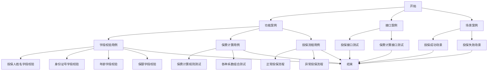
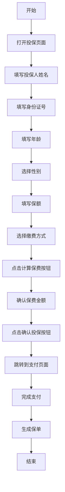

# 规约与设计介绍案例

## 一、案例背景

### 1.1 业务场景
本案例以**保险投保功能**为例，展示如何使用测试设计助手系统的**规约驱动测试设计**和**设计文档生成**功能。

### 1.2 业务需求
**需求名称**：个人寿险在线投保功能  
**需求编码**：REQ-20240117-001  
**需求描述**：
- 用户可以在线填写投保信息（姓名、身份证号、年龄、性别、职业、保额、缴费方式等）
- 系统自动计算保费
- 支持多种缴费方式（年缴、月缴、一次性缴费）
- 投保成功后生成保单

### 1.3 测试目标
- 验证投保流程的完整性和正确性
- 验证字段校验规则的有效性
- 验证保费计算的准确性
- 验证不同缴费方式的处理逻辑

---

## 二、规约驱动测试设计

### 2.1 创建测试规约

#### 2.1.1 创建应用级规约

**规约信息**：
- **规约名称**：个人寿险投保测试规约
- **规约编码**：SPEC-20240117-001（系统自动生成）
- **规约类型**：APPLICATION（应用级规约）
- **适用模块**：投保模块
- **适用测试分层**：功能案例、接口案例、场景案例
- **适用测试方法**：等价类、边界值、场景法、决策表

**规约描述**：
本规约定义了个人寿险在线投保功能的测试设计规范，包括字段测试要点、逻辑测试要点、测试分层规范等。

#### 2.1.2 规约版本管理

创建规约后，系统自动创建版本：
- **版本号**：v1.0
- **版本状态**：当前版本
- **创建时间**：2024-01-17

后续如需修改规约，可以创建新版本（v1.1、v2.0等），支持版本切换和历史追溯。

---

### 2.2 定义字段测试要点

#### 2.2.1 必填字段测试要点

**字段1：投保人姓名**
- **字段名称**：投保人姓名
- **字段类型**：STRING
- **是否必填**：是
- **测试要求**：
  - 必填校验：不能为空
  - 长度校验：2-50个字符
  - 格式校验：只能包含中文、英文、数字
  - 特殊字符校验：不能包含特殊符号
- **测试方法**：等价类、边界值
- **测试用例示例**：
  ```json
  {
    "有效等价类": [
      {"value": "张三", "expected": "通过"},
      {"value": "John Smith", "expected": "通过"},
      {"value": "李四123", "expected": "通过"}
    ],
    "无效等价类": [
      {"value": "", "expected": "提示：投保人姓名不能为空"},
      {"value": "A", "expected": "提示：姓名长度必须在2-50个字符之间"},
      {"value": "张@三", "expected": "提示：姓名不能包含特殊字符"}
    ],
    "边界值": [
      {"value": "张", "expected": "提示：姓名长度必须在2-50个字符之间"},
      {"value": "张三", "expected": "通过"},
      {"value": "50个字符的姓名...", "expected": "通过"},
      {"value": "51个字符的姓名...", "expected": "提示：姓名长度不能超过50个字符"}
    ]
  }
  ```
- **验证规则**：
  ```json
  {
    "required": true,
    "minLength": 2,
    "maxLength": 50,
    "pattern": "^[\\u4e00-\\u9fa5a-zA-Z0-9]+$"
  }
  ```

**字段2：身份证号**
- **字段名称**：身份证号
- **字段类型**：STRING
- **是否必填**：是
- **测试要求**：
  - 必填校验：不能为空
  - 格式校验：18位身份证号格式
  - 校验位校验：身份证号校验位正确性
  - 唯一性校验：同一身份证号不能重复投保
- **测试方法**：等价类、边界值
- **测试用例示例**：
  ```json
  {
    "有效等价类": [
      {"value": "110101199001011234", "expected": "通过"}
    ],
    "无效等价类": [
      {"value": "", "expected": "提示：身份证号不能为空"},
      {"value": "12345678901234567", "expected": "提示：身份证号格式不正确"},
      {"value": "11010119900101123X", "expected": "提示：身份证号校验位不正确"}
    ]
  }
  ```

**字段3：年龄**
- **字段名称**：年龄
- **字段类型**：NUMBER
- **是否必填**：是
- **测试要求**：
  - 必填校验：不能为空
  - 范围校验：18-65岁
  - 类型校验：必须为整数
- **测试方法**：等价类、边界值
- **测试用例示例**：
  ```json
  {
    "有效等价类": [
      {"value": 25, "expected": "通过"},
      {"value": 18, "expected": "通过"},
      {"value": 65, "expected": "通过"}
    ],
    "无效等价类": [
      {"value": null, "expected": "提示：年龄不能为空"},
      {"value": 17, "expected": "提示：年龄必须在18-65岁之间"},
      {"value": 66, "expected": "提示：年龄必须在18-65岁之间"},
      {"value": 25.5, "expected": "提示：年龄必须为整数"}
    ],
    "边界值": [
      {"value": 17, "expected": "提示：年龄必须在18-65岁之间"},
      {"value": 18, "expected": "通过"},
      {"value": 19, "expected": "通过"},
      {"value": 64, "expected": "通过"},
      {"value": 65, "expected": "通过"},
      {"value": 66, "expected": "提示：年龄必须在18-65岁之间"}
    ]
  }
  ```

**字段4：保额**
- **字段名称**：保额
- **字段类型**：NUMBER
- **是否必填**：是
- **测试要求**：
  - 必填校验：不能为空
  - 范围校验：10万-500万
  - 步长校验：必须是1万的整数倍
- **测试方法**：等价类、边界值
- **测试用例示例**：
  ```json
  {
    "有效等价类": [
      {"value": 100000, "expected": "通过"},
      {"value": 500000, "expected": "通过"},
      {"value": 300000, "expected": "通过"}
    ],
    "无效等价类": [
      {"value": null, "expected": "提示：保额不能为空"},
      {"value": 50000, "expected": "提示：保额必须在10万-500万之间"},
      {"value": 6000000, "expected": "提示：保额必须在10万-500万之间"},
      {"value": 150000, "expected": "提示：保额必须是1万的整数倍"}
    ]
  }
  ```

#### 2.2.2 可选字段测试要点

**字段5：职业**
- **字段名称**：职业
- **字段类型**：STRING
- **是否必填**：否
- **测试要求**：
  - 可选校验：可以为空
  - 枚举值校验：必须从职业列表中选择
- **测试方法**：等价类
- **测试用例示例**：
  ```json
  {
    "有效等价类": [
      {"value": "", "expected": "通过"},
      {"value": "IT工程师", "expected": "通过"},
      {"value": "医生", "expected": "通过"}
    ],
    "无效等价类": [
      {"value": "自定义职业", "expected": "提示：请从职业列表中选择"}
    ]
  }
  ```

---

### 2.3 定义逻辑测试要点

#### 2.3.1 业务规则测试要点

**逻辑1：保费计算规则**
- **逻辑名称**：保费计算规则
- **逻辑类型**：BUSINESS_CALCULATION
- **逻辑描述**：
  - 保费 = 基础保费 × 年龄系数 × 性别系数 × 职业系数 × 缴费方式系数
  - 基础保费 = 保额 × 0.001
  - 年龄系数：18-30岁=1.0，31-45岁=1.2，46-65岁=1.5
  - 性别系数：男性=1.0，女性=0.9
  - 职业系数：普通职业=1.0，高风险职业=1.5
  - 缴费方式系数：年缴=1.0，月缴=0.95，一次性缴费=0.9
- **测试要求**：
  - 验证保费计算公式的正确性
  - 验证各种系数组合的计算结果
  - 验证边界值的计算准确性
- **测试方法**：等价类、决策表
- **测试用例示例**：
  ```json
  {
    "用例1": {
      "保额": 100000,
      "年龄": 25,
      "性别": "男",
      "职业": "IT工程师",
      "缴费方式": "年缴",
      "预期保费": 100
    },
    "用例2": {
      "保额": 100000,
      "年龄": 35,
      "性别": "女",
      "职业": "医生",
      "缴费方式": "月缴",
      "预期保费": 102.6
    }
  }
  ```
- **验证规则**：
  ```json
  {
    "formula": "保费 = 保额 × 0.001 × 年龄系数 × 性别系数 × 职业系数 × 缴费方式系数",
    "tolerance": 0.01
  }
  ```
- **适用场景**：投保信息填写完成后，点击"计算保费"按钮

**逻辑2：投保资格校验规则**
- **逻辑名称**：投保资格校验规则
- **逻辑类型**：BUSINESS_RULE
- **逻辑描述**：
  - 年龄必须在18-65岁之间
  - 高风险职业（如矿工、消防员）需要额外审核
  - 同一身份证号不能重复投保
- **测试要求**：
  - 验证年龄限制规则
  - 验证高风险职业的特殊处理
  - 验证重复投保的拦截
- **测试方法**：场景法、决策表
- **测试用例示例**：
  ```json
  {
    "场景1": {
      "年龄": 20,
      "职业": "IT工程师",
      "身份证号": "110101199001011234",
      "预期结果": "通过校验，可以投保"
    },
    "场景2": {
      "年龄": 17,
      "职业": "IT工程师",
      "身份证号": "110101199001011234",
      "预期结果": "提示：年龄不符合投保要求"
    },
    "场景3": {
      "年龄": 30,
      "职业": "矿工",
      "身份证号": "110101199001011234",
      "预期结果": "提示：高风险职业需要额外审核"
    },
    "场景4": {
      "年龄": 25,
      "职业": "IT工程师",
      "身份证号": "110101199001011234（已存在）",
      "预期结果": "提示：该身份证号已投保，不能重复投保"
    }
  }
  ```

#### 2.3.2 业务流程测试要点

**逻辑3：投保流程**
- **逻辑名称**：投保流程
- **逻辑类型**：WORKFLOW
- **逻辑描述**：
  1. 填写投保信息
  2. 计算保费
  3. 确认投保信息
  4. 支付保费
  5. 生成保单
- **测试要求**：
  - 验证流程的完整性
  - 验证每个步骤的前置条件
  - 验证异常流程的处理
- **测试方法**：场景法、状态转换
- **测试用例示例**：
  ```json
  {
    "主流程": [
      "填写投保信息 → 计算保费 → 确认投保信息 → 支付保费 → 生成保单"
    ],
    "异常流程": [
      "填写投保信息 → 信息校验失败 → 提示错误",
      "计算保费 → 保费计算失败 → 提示错误",
      "支付保费 → 支付失败 → 提示错误，返回上一步"
    ]
  }
  ```
- **适用场景**：完整的投保流程测试

---

### 2.4 规约应用

#### 2.4.1 用例生成时应用规约

当使用AI生成测试用例时，系统会自动匹配适用的规约，并将规约内容注入到提示词中：

**匹配规则**：
1. 根据需求关联的模块匹配规约（投保模块 → 个人寿险投保测试规约）
2. 根据测试分层匹配规约（功能案例 → 适用功能案例的规约）
3. 根据测试方法匹配规约（等价类 → 适用等价类的规约）

**规约内容注入**：
- 字段测试要点：自动注入字段校验规则和测试用例示例
- 逻辑测试要点：自动注入业务规则和测试场景
- 测试方法规范：自动注入测试方法的使用要求

**生成结果**：
生成的测试用例会自动包含：
- 字段级别的测试用例（基于字段测试要点）
- 逻辑级别的测试用例（基于逻辑测试要点）
- 符合规约要求的测试步骤和预期结果

#### 2.4.2 用例审核时检查规约

在用例审核时，系统会自动检查用例是否符合规约要求：

**检查项**：
1. **必填字段检查**：检查用例是否覆盖了所有必填字段的测试要点
2. **逻辑规则检查**：检查用例是否覆盖了所有业务规则和流程
3. **测试方法检查**：检查用例使用的测试方法是否符合规约要求
4. **测试覆盖检查**：检查用例是否覆盖了所有测试场景

**检查结果**：
- **符合性评分**：0-100分，表示用例符合规约的程度
- **问题清单**：列出不符合规约的具体问题
- **改进建议**：提供具体的改进建议

**示例检查报告**：
```
规约符合性检查报告
==================
用例编码：CASE-20240117-001
用例名称：投保人姓名字段校验测试
规约编码：SPEC-20240117-001

检查结果：
- 总检查项：10
- 通过项：8
- 失败项：2
- 符合性评分：80分

问题清单：
1. [HIGH] 缺少边界值测试：姓名长度为1个字符的测试用例
2. [MEDIUM] 缺少特殊字符测试：包含@符号的测试用例

改进建议：
1. 添加姓名长度为1个字符的边界值测试用例
2. 添加包含特殊字符的无效等价类测试用例
```

---

## 三、设计文档生成

### 3.1 场景图生成

#### 3.1.1 基于需求生成场景图

**输入**：
- 需求ID：REQ-20240117-001
- 图表标题：个人寿险投保功能场景图
- 图表方向：TB（从上到下）
- 包含用例详情：是

**生成结果**：
系统会提取需求下的所有测试用例，按用例类型分组，生成Mermaid格式的场景图：



**导出格式**：
- PNG图片
- SVG矢量图
- PDF文档

#### 3.1.2 基于用例列表生成场景图

**输入**：
- 用例ID列表：[CASE-20240117-001, CASE-20240117-002, CASE-20240117-003]
- 图表标题：投保功能核心场景图
- 图表方向：LR（从左到右）

**生成结果**：
系统会提取指定用例的信息，生成精简的场景图。

---

### 3.2 路径图生成

#### 3.2.1 基于单个用例生成路径图

**输入**：
- 用例ID：CASE-20240117-001（投保流程测试用例）
- 图表标题：投保流程路径图
- 图表方向：TB（从上到下）

**用例测试步骤**：
1. 打开投保页面
2. 填写投保人姓名：张三
3. 填写身份证号：110101199001011234
4. 填写年龄：25
5. 选择性别：男
6. 填写保额：100000
7. 选择缴费方式：年缴
8. 点击"计算保费"按钮
9. 确认保费金额：100元
10. 点击"确认投保"按钮
11. 跳转到支付页面
12. 完成支付
13. 生成保单

**生成结果**：
系统会从用例的测试步骤中提取路径节点和边，生成路径图：



#### 3.2.2 基于需求生成路径图

**输入**：
- 需求ID：REQ-20240117-001
- 图表标题：投保功能完整路径图
- 图表方向：TB

**生成结果**：
系统会提取需求下所有用例的测试步骤，合并相同步骤，生成完整的路径图，展示所有可能的执行路径。

---

### 3.3 等价类表生成

#### 3.3.1 基于需求生成等价类表

**输入**：
- 需求ID：REQ-20240117-001
- 参数提取方式：自动提取（从需求描述和用例中提取测试参数）

**提取的测试参数**：
1. **投保人姓名**
   - 有效等价类：2-50个字符的中文、英文、数字组合
   - 无效等价类：空值、1个字符、51个字符、包含特殊字符
2. **年龄**
   - 有效等价类：18-65岁
   - 无效等价类：小于18岁、大于65岁、非整数
3. **保额**
   - 有效等价类：10万-500万，且为1万的整数倍
   - 无效等价类：小于10万、大于500万、不是1万的整数倍

**生成结果**：
系统使用笛卡尔积算法生成所有等价类组合，生成等价类表：

| 用例编号 | 投保人姓名 | 年龄 | 保额 | 有效性 | 预期结果 |
|---------|-----------|------|------|--------|---------|
| EQ-001 | 张三（有效） | 25（有效） | 100000（有效） | 有效 | 通过校验 |
| EQ-002 | 张三（有效） | 25（有效） | 50000（无效） | 无效 | 提示：保额必须在10万-500万之间 |
| EQ-003 | 张三（有效） | 25（有效） | 150000（无效） | 无效 | 提示：保额必须是1万的整数倍 |
| EQ-004 | 张三（有效） | 17（无效） | 100000（有效） | 无效 | 提示：年龄必须在18-65岁之间 |
| EQ-005 | 张三（有效） | 66（无效） | 100000（有效） | 无效 | 提示：年龄必须在18-65岁之间 |
| EQ-006 | （空值，无效） | 25（有效） | 100000（有效） | 无效 | 提示：投保人姓名不能为空 |
| EQ-007 | A（无效） | 25（有效） | 100000（有效） | 无效 | 提示：姓名长度必须在2-50个字符之间 |
| ... | ... | ... | ... | ... | ... |

**导出格式**：
- Excel格式（.xlsx）
- Word格式（.docx）

#### 3.3.2 直接指定参数生成等价类表

**输入**：
- 参数定义：
  ```json
  {
    "参数1": {
      "名称": "投保人姓名",
      "有效等价类": ["2-50个字符的中文、英文、数字组合"],
      "无效等价类": ["空值", "1个字符", "51个字符", "包含特殊字符"]
    },
    "参数2": {
      "名称": "年龄",
      "有效等价类": ["18-65岁"],
      "无效等价类": ["小于18岁", "大于65岁", "非整数"]
    }
  }
  ```

**生成结果**：
系统根据指定的参数定义生成等价类表。

---

### 3.4 正交表生成

#### 3.4.1 直接指定因素和水平生成正交表

**输入**：
- 因素和水平定义：
  ```json
  {
    "因素1": {
      "名称": "年龄",
      "水平": ["18-30岁", "31-45岁", "46-65岁"]
    },
    "因素2": {
      "名称": "性别",
      "水平": ["男", "女"]
    },
    "因素3": {
      "名称": "职业",
      "水平": ["普通职业", "高风险职业"]
    },
    "因素4": {
      "名称": "缴费方式",
      "水平": ["年缴", "月缴", "一次性缴费"]
    }
  }
  ```

**生成结果**：
系统自动选择适合的正交表类型（L12正